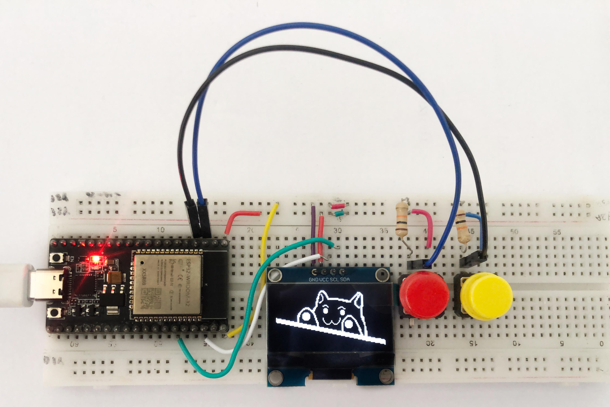
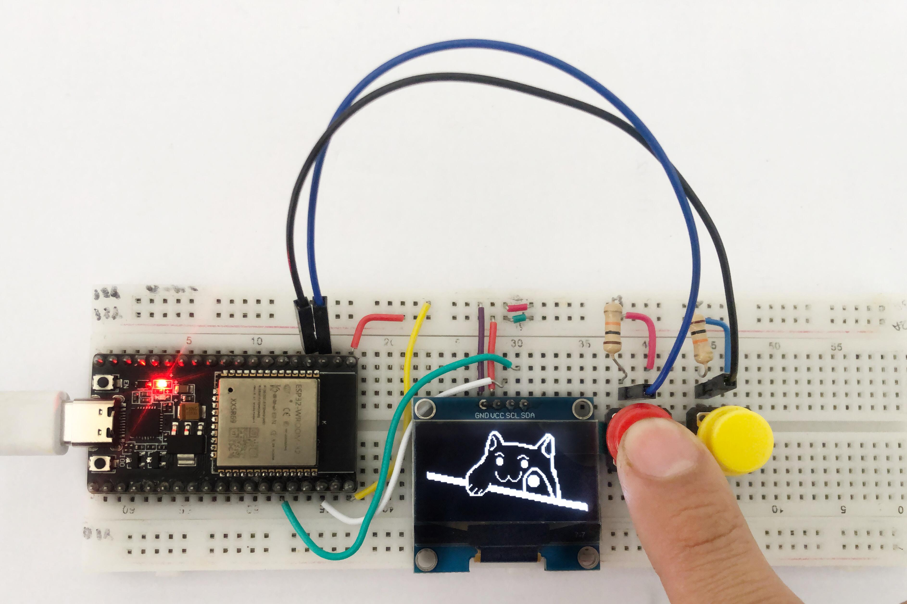
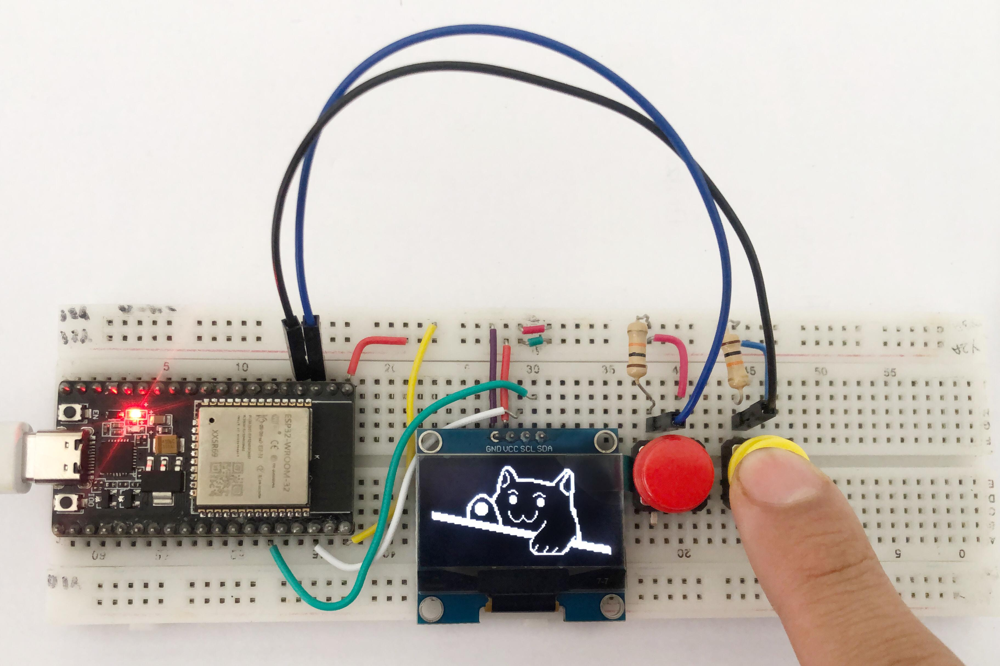
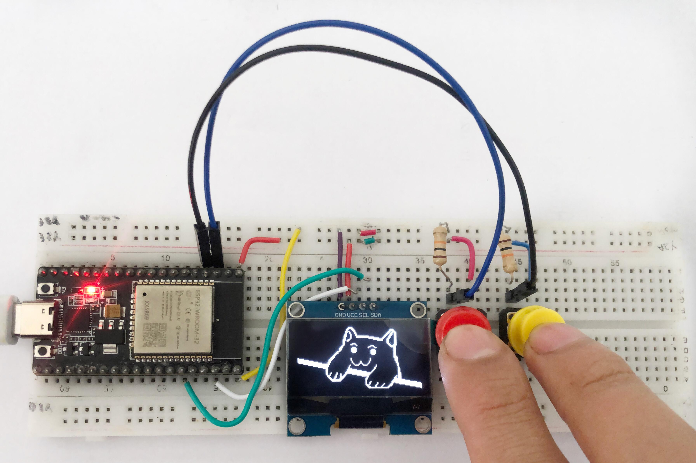

# Cat-Game-128x64
  
Cat Game o Juego del Gato, es un proyecto simple, cuya finalidad es que se puedan diseñar imagenes para un display OLED de 1.9'', consta de dos botones y cada uno de ellos afecta la imagen en general. La imagen es de un gato que bajara una mano dependiendo del boton que se presione. El objetivo es que se entienda el concepto de como se dibujan las imagenes en las pantallas y como gestionar la creacion de esta a traves de herramientas de calculo como lo pueden ser Excel o GoogleSheets. 

<h2>Software y Materiales</h2>
El programa para el ESP32 creado en ArduinoIDE se encuentra <a href="www.google.com">aqui</a>. 
La hoja de calculo para gestionar las matrices del dibujo se encuentran en este documento de <a href="www.facebook.com">Excel</a>.  

<table>
<thead>
<tr>
<th>Unidad</th>
<th>Elemento</th>
<th>Referencia</th>
</tr>
</thead>
<tbody>
<tr>
<td>01</td>
<td>ESP32</td>
<td><a href="https://blogger.googleusercontent.com/img/b/R29vZ2xl/AVvXsEhrW_XK8NA6iEWP04ahhA3hUbB9TkLdeRnECh-9sQHLkG0m5_FIogpinEXzy9AD0lwb3kS6KKQIx3SEpUq33jvhHRGgqhAS2hvE47NJgvAsTMLHs5BDUgq4vgFCMkSex_cxhcRRCFbSd4k/s1211/ESP32.jpg">Modelo de 19 pines</a></td>
</tr>
<tr>
<td>01</td>
<td>Pantalla OLED 1.3'' </td>
<td><a href="https://dualtronica.com/3696-thickbox_default/pantalla-oled-13-azul-comunicacion-i2c-128x64.jpg"> Modelo con i2C</a></td>
</tr>
<tr>
<td>02</td>
<td>Resistencias de 10K Ohms</td>
<td>
   
</td>
</tr>
<tr>
<td>02</td>
<td>Pulsadores / Botones</td>
<td>Normalmente Abierto</td>
</tr>
<tr>
<td>10</td>
<td>Cables conectores</td>
<td>Tipo: Macho-Macho</td>
</tr>
</tbody>
</table>

<h2>Objetivos</h2>
<ul>
  <li>Aprender a crear imagenes de 128x64 bits</li>
  <li>Manejo de pulsadores tipo Pull-up</li>
</ul>

<h2>Funcionamiento</h2>
<b>Primera accion: </b>Al presionar el boton rojo (Izquierda) el dibujo del gato baja su pata derecha.   

<b>Segunda accion: </b>Al presionar el boton amarillo (Derecha) el dibujo del gato baja su pata izquierda.   

<b>Tercera accion: </b>Al presionar ambos botones el dibujo del gato baja ambas patas.  

<h3>Documentacion</h3>
El ESP32 imprime en la matriz de la OLED bit por bit de izquierda a derecha, manda un 1 para que el led se encienda y un 0 para que el led se apague, este proceso se repite para una matriz de 128x64, la idea es que se haga un patron de ceros y unos para la imagen de un total de 8192 puntos, como este patron seria muy largo, se agrupa en bloques de 8 bits y luego cada bloque es transformado a formato Hexadecimal, para imprimir una cadena de datos un poco mas corta y manipulable. 
Para poder dibujar la imagen que desea descargue el 

<h3>Creditos</h3>
<ul>
<li>Diseño y Construccion: Boyd Robert Mallqui Rodriguez</li>
<li>Creadora macro de Excel:<a href="https://www.youtube.com/watch?v=UpN1Kx6uz_U&t=0s"> Maria Paula</a> nos basamos en sus macros para poder crear el mismo sistema en un ESP32.</li>
<li>Video de inspiracion de <a href="https://www.instagram.com/reel/C5qtH2cLLbm/?utm_source=ig_web_copy_link&igsh=MzRlODBiNWFlZA==">Instagram</a></li>
</ul>
