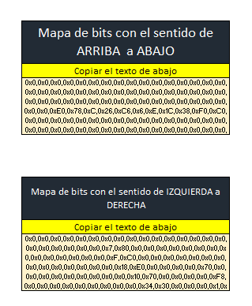
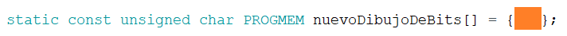

# Cat-Game-128x64
  
Cat Game o Juego del Gato, es un proyecto simple, cuya finalidad es que se puedan diseñar imagenes para un display OLED de 1.9'', consta de dos botones y cada uno de ellos afecta la imagen en general. La imagen es de un gato que bajara una mano dependiendo del boton que se presione. El objetivo es que se entienda el concepto de como se dibujan las imagenes en las pantallas y como gestionar la creacion de esta a traves de herramientas de calculo como lo pueden ser Excel o GoogleSheets. 

<h1>Software y Materiales</h1> 
El programa para el ESP32 creado en ArduinoIDE se encuentra <a href="proyecto_gatito.ino">aqui</a>. 
La hoja de calculo para gestionar las matrices del dibujo se encuentran en este documento de <a href="Creador de mapa de bits.xlsm">Excel</a>.  

<table>
<thead>
<tr>
<th>Unidad</th>
<th>Elemento</th>
<th>Referencia</th>
</tr>
</thead>
<tbody>
<tr>
<td>01</td>
<td>ESP32</td>
<td><a href="https://blogger.googleusercontent.com/img/b/R29vZ2xl/AVvXsEhrW_XK8NA6iEWP04ahhA3hUbB9TkLdeRnECh-9sQHLkG0m5_FIogpinEXzy9AD0lwb3kS6KKQIx3SEpUq33jvhHRGgqhAS2hvE47NJgvAsTMLHs5BDUgq4vgFCMkSex_cxhcRRCFbSd4k/s1211/ESP32.jpg">Modelo de 19 pines</a></td>
</tr>
<tr>
<td>01</td>
<td>Pantalla OLED 1.3'' </td>
<td><a href="https://dualtronica.com/3696-thickbox_default/pantalla-oled-13-azul-comunicacion-i2c-128x64.jpg"> Modelo con i2C</a></td>
</tr>
<tr>
<td>02</td>
<td>Resistencias de 10K Ohms</td>
<td>
   
</td>
</tr>
<tr>
<td>02</td>
<td>Pulsadores / Botones</td>
<td>Normalmente Abierto</td>
</tr>
<tr>
<td>10</td>
<td>Cables conectores</td>
<td>Tipo: Macho-Macho</td>
</tr>
</tbody>
</table>

<h1>Objetivos</h1>
<ul>
  <li>Aprender a crear imagenes de 128x64 bits</li>
  <li>Manejo de pulsadores tipo Pull-up</li>
</ul>

<h1>Funcionamiento</h1>
<b>Primera accion: </b>Al presionar el boton rojo (Izquierda) el dibujo del gato baja su pata derecha.   

<b>Segunda accion: </b>Al presionar el boton amarillo (Derecha) el dibujo del gato baja su pata izquierda.   

<b>Tercera accion: </b>Al presionar ambos botones el dibujo del gato baja ambas patas.  

<h1>Documentacion</h1>
El ESP32 imprime en la matriz de la OLED bit por bit de izquierda a derecha, manda un 1 para que el led se encienda y un 0 para que el led se apague, este proceso se repite para una matriz de 128x64, la idea es que se haga un patron de ceros y unos para la imagen de un total de 8192 puntos, como este patron seria muy largo, se agrupa en bloques de 8 bits y luego cada bloque es transformado a formato Hexadecimal, para imprimir una cadena de datos un poco mas corta y manipulable.  

Para poder dibujar la imagen que desea descargue el <a href="Creador de mapa de bits.xlsm">Excel</a>, una vez hecho entre a la hoja de calculo y <b>permita la edicion y los macros</b> (aparecera el boton de "habilitar" en la parte de arriba) la hoja esta diseñada para que con cada click el cuadrado selecionado invierta su valor de cero a uno o viceversa, una vez realizado el dibujo en la parte derecha se encontraran dos cuadros para copiar.  
<b>El primero: </b> Es la concatenacion de los bits en el orden de izquierda a derecha, fila por fila. Este es el modelo en el que trabaja nuestra libreria de Adrafruit. 
<b>El segundo: </b> Es la concatenacion de los bits de arriba hacia abajo, columna por columna. Este es el modelo en el que trabajan otras librerias generalmente de Arduino o las personalizadas que podemos encontrar en internet. 
 
Una vez copiado el mapa de bits debemos hacer lo siquiente si queremos añadirlo a nuestro programa. 

<h2>Primer Paso</h2>
Descargue el <a href="proyecto_gatito.ino">codigo en ArduinoIDE</a> y paselo a la ESP32 de su preferencia. Verifique que los puertos GIOP que usaremos con entradas esten bien asisganados en su modelo. Recuerde que si su modelo de ESP32 es diferente, asigne otros pines para los botones, y de preferencia que sean los asignados a los puertos digitales. 
Tambien verifique que los puertos de SCL y SDA de la pantalla OLED, esten conectados correctamente a los puertos de su ESP32, si usara un modelo diferente (Ejemplo el de1 15 pines) busque en su hoja de datos que pines corresponden para el SCL y el SDA y conectelos alli. 

<h2>Segundo Paso</h2>
Realize las conexiones segun el esquematico que se a previsto para esto: 

<h2>Tercer Paso</h2>
Crear un variable de cierto tipo y agregar dentro de sus parentesis el codigo del mapa de bits. <b>Recordar que el mapa de bits no debe terminar en coma</b>, fijese en el final de la cadena, si aparece por error una coma, eliminela. Tenga en cuenta que por patrones de programacion el final de la llave que contendra al mapa de bits, si debe tener su ; respectivo, o sino el codigo les mandara error. 
 

# Creditos
<ul>
<li>Diseño y Construccion: Boyd Robert Mallqui Rodriguez</li>
<li>Creadora macro de Excel:<a href="https://www.youtube.com/watch?v=UpN1Kx6uz_U&t=0s"> Maria Paula</a> nos basamos en sus macros para poder crear el mismo sistema en un ESP32.</li>
<li>Video de inspiracion de <a href="https://www.instagram.com/reel/C5qtH2cLLbm/?utm_source=ig_web_copy_link&igsh=MzRlODBiNWFlZA==">Instagram</a></li>
</ul>
